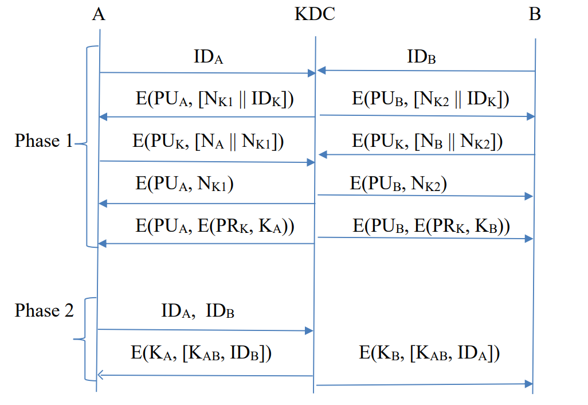
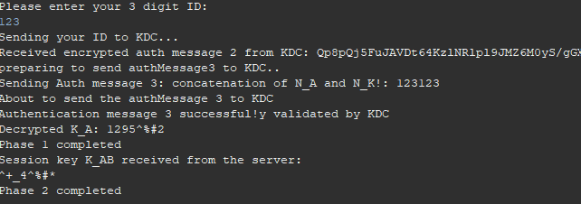
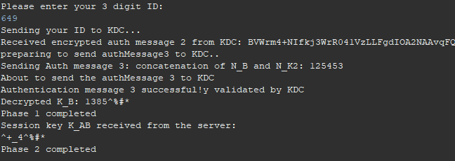

# Objective
A hybrid key distribution protocol has been implemented. A central key distribution server (KDC) has been implemented
to exchange messages with two clients named A and B.

# Implementation Details
A hybrid key distribution protocol has been implemented. A central key distribution server (KDC) has been implemented
to exchange messages with two clients named A and B.

The key distribution completes in two stages:
* Stage 1: Public-key cryptography is used to distribute a master key K_a (a symmetric key shared by KDC and client A) and a master key K_b (a symmetric key shared by KDC and client B). Both K_a and K_b are generated by KDC. 
* Stage 2: The KDC server now generates a session key K_ab and seperately send it to A and B.	

PU_A: Public key of client A 
PU_B: Public key of client B 
PU_K: Public key of KDC 
PR_K: Private key of KDC 
N_K1, N_K2: Generated nonces by the KDC server 
ID_K: KDC server ID 
K_A: Master key shared between only client A and KDC 
K_B: Master key shared between only client B and KDC 
K_AB: Session key generated by the KDC and shared only between client A and B

